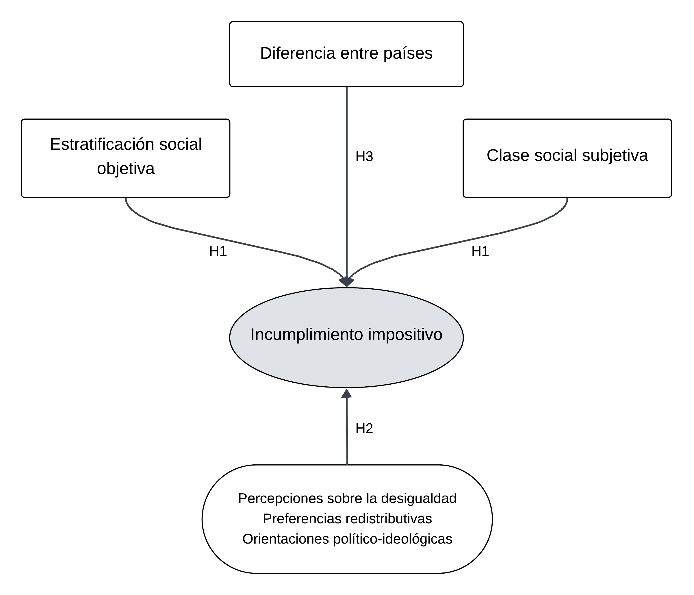

```{r include=FALSE}
rm(list = ls())

pacman::p_load(tidyverse, Hmisc, gtsummary, GDAtools, jtools, huxtable, survey, ggoxford, ggtext, factoextra, paletteer)

load("bases/latinobarometro_select.RData")
load("bases/ingresos_tributarios_wb_tot.RData")
load("bases/base_datos_agregados.RData")

ingresos_tributarios_wb_tot <- ingresos_tributarios_wb_tot %>% 
  rename(iso3 = pais)

theme_set(theme_bw())

knitr::opts_chunk$set(cache = FALSE, warning = FALSE, 
                      message = FALSE, cache.lazy = FALSE,
                      dpi = 300)

```


```{r variables, include=FALSE}
latinobarometro <- latinobarometro %>% 
  mutate(arreglo_impuestos = ifelse(arreglo_impuestos == 2, 0, 1),
         evasion_dic = ifelse(evasion == 1, 1, 0),
         evasion_dic2 = ifelse(evasion == 1, 0, 1),
         evasion_dic3 = ifelse(evasion >= 7, 1, 0),
         argentina_lat = case_when(pais == 32 ~ "Argentina",
                                   TRUE ~ "Resto América Latina"),
         pro_mercado_dic = factor(case_when(pro_mercado_f == "Muy de acuerdo" ~ "De acuerdo",
                                            pro_mercado_f == "De acuerdo" ~ "De acuerdo",
                                            pro_mercado_f == "En desacuerdo" ~ "En desacuerdo",
                                            pro_mercado_f == "Muy en desacuerdo" ~ "En desacuerdo",
                                            TRUE ~ NA_character_))) %>% 
  filter(pais_f != "Esp")


#Banderas
latinobarometro <- latinobarometro %>% 
  mutate(iso3 = countrycode::countrycode(pais,
                                         origin = "iso3n",
                                         destination = "iso3c"),
         anio_pais = interaction(iso3, anio))

#Unión
latinobarometro <- latinobarometro %>% 
  left_join(ingresos_tributarios_wb_tot, by = c("anio", "iso3"))

#Unión bases individual y agregada
latinobarometro <- latinobarometro %>% 
  left_join(datos_paises, by = c("anio", "iso3")) 

latinobarometro <- latinobarometro %>% 
  mutate(anio_pais = interaction(iso3, anio))

latinobarometro$pib_ppa_log <- log(latinobarometro$pib_ppa)

```

# Introducción y antecedentes {background-color="#00589b"}

## Introducción y antecedentes

:::incremental

- Los **impuestos** como terreno de disputas por los procesos distributivos, redistributivos y de legitimación social y política en nuestras sociedades.  

- Abordajes: 
  - estudios económicos y sociales sobre evasión tributaria (racionalidad y moral tributaria)
  - estudios sociológicos sobre preferencias redistributivas  

- Necesidad de comprender estos comportamientos a partir de la posición de las personas en la estructura social y de las representaciones que tienen sobre la desigualdad social.

:::

## Introducción y objetivo

::: columns
::: {.column width="50%"}
- **Objetivo**: Explorar la relación entre desigualdad social y prácticas impositivas en América Latina, más específicamente entre posición en la estructura social e incumplimiento impositivo.
:::

::: {.column width="50%"}
::: fragment
{width=100%}
:::
:::
:::


## Estudios sobre evasión, sociología fiscal y moral tributaria 

::::incremental
::: {style="font-size: 0.80em"}

- El alto nivel de evasión impositiva calculada para América Latina implica un límite estructural a la capacidad recaudatoria de los países de la región 
  - América Latina y el Caribe recaudó en impuestos, durante 2023, un 21,3% de su PIB (OCDE: 33,9%)

- Estudios de moral fiscal:  
  - Efectos positivos del carácter ritualizado del pago de impuestos directos en contraposición al carácter tácito del pago de los impuestos indirectos (Atria, 2022; Braunstein, 2024). 
  - La moral fiscal correlaciona de manera negativa con el volumen de la economía informal (Torgler, 2007).
  - La creencia en la autoridad estatal o la adhesión a subculturas de evasión, son los principales elementos explicativos del incumplimiento tributario (Bergman, 2015).


:::
::::

# Datos, variables y técnicas {background-color="#00589b"}

## Fuente de datos

:::incremental
- Latinobarómetro 2020 (1998-2020)
- Países de la muestra (18): Argentina, Bolivia, Brasil, Chile, Colombia, Costa Rica, Ecuador, El Salvador, Guatemala, Honduras, México, Nicaragua, Panamá, Paraguay, Perú, República Dominicana, Uruguay y Venezuela. 
:::

::: fragment
::: {.callout-tip title="Pregunta central" icon="false"}
¿Podría decirme si, recientemente, sabe Ud. de alguna persona, o ha oído Ud. comentar a algún familiar o conocido sobre alguien que se las arregló para pagar menos impuestos de lo que debía? 
:::

:::


## Variables

::: columns
::: {.column width="35%"}
Se construyó un índice de estratificación social utilizando como técnica el *análisis de correspondencias múltiples* a partir de la información ocupacional, educativa y de bienes.
:::

::: {.column width="65%"}
::: fragment

```{r ACM, echo=FALSE}
#| fig-width: 8
#| fig-height: 5


latinobarometro <- latinobarometro %>%  
  mutate(trabajo_f = case_when(
    estado_ocupacional_f %in% c("Temporalmente no trabaja", "Retirado/pensionado") ~ trabajo_anterior_f, 
                               estado_ocupacional_f %in% c("No trabaja", "Estudiante") ~ "No trabaja",
         TRUE ~ trabajo_actual_f))


#2020
var_obj_2020 <- latinobarometro %>%
  filter(anio == 2020) %>%
  select(trabajo_f, nivel_ed, bienes_comp, bienes_lava, bienes_telef, bienes_celular, bienes_auto, bienes_cloaca, bienes_aguapot,
         bienes_aguacal, bienes_casa, wt)

mca2020 <- speMCA(var_obj_2020[,1:11], ncp = 2, row.w = var_obj_2020$wt)

mca2020 <- flip.mca(mca2020, dim = 1)


#Construcción de índice (estandarizado)
estandarizar_ponderado <- function(x, w) {
  media_ponderada <- sum(x * w) / sum(w)
  var_ponderada <- sum(w * (x - media_ponderada)^2) / sum(w)
  desv_ponderada <- sqrt(var_ponderada)
  return((x - media_ponderada) / desv_ponderada)
}

coords_2020 <- data.frame(anio = 2020, dim1 = mca2020$ind$coord[,1])


# Filtrar y unir con coordenadas
latinobarometro2020 <- latinobarometro %>%
  filter(anio == 2020) %>%
  bind_cols(dim1 = coords_2020$dim1) %>%
  mutate(dim1_std = estandarizar_ponderado(dim1, wt),
         dim1_01= scales::rescale(dim1, to = c(0, 1)))


latinobarometro2020 %>% 
  group_by(iso3) %>%
  summarise(
  promedio = weighted.mean(dim1_std, wt = wt, na.rm = T)) %>%
  ggplot(aes(x = fct_reorder(iso3, promedio, .desc = T), y = promedio)) +
  geom_hline(yintercept = 0, linetype = "dashed", color = "red") +
  geom_segment(aes(x=iso3, xend=iso3, y=0, yend=promedio), color="orange") +
  geom_point( color="orange", size=3) +
  geom_axis_flags(breaks = latinobarometro$iso3,
                  labels = latinobarometro$pais_f,
                  country_icons = latinobarometro$iso3,
                  width = 20,
                  lineheight = 2) +
  labs(title = "Índice de estratificación social objetiva promedio",
       subtitle = "Países seleccionados de América Latina. 2020",
       caption = "Fuente: elaboración propia en base a Latinobarómetro") +
  theme(axis.title.x = element_blank(),
        axis.title.y = element_blank(),
        axis.text.y = element_text(size = 11)) +
  scale_y_continuous(limits = c(-1, 1), breaks = seq(-1, 1, .5))

```
:::
:::
:::

## Variables 


```{r descriptivos}
theme_gtsummary_language("es", decimal.mark = ",", big.mark = ".")
theme_gtsummary_compact()

tabla_descriptivos <- latinobarometro2020 %>%
  svydesign(data = ., ids = ~ 1, weights = ~wt) %>%
  tbl_svysummary(include = c(edad, sexo2, dim1_std, clase_subjetiva4, just_dist_ingresos_dic, pro_mercado_dic, ayuda_pobres_dinero_f, ayuda_gobierno_tramo_f, pago_impuestos_dic, aceptabilidad_desigualdad, corrupcion_f, ideologia, arreglo_impuestos),
                 label = c(edad ~ "Edad", 
                           sexo2 ~ "Sexo", 
                           dim1_std ~ "Índice de estratificación", 
                           clase_subjetiva4 ~ "Clase subjetiva", 
                           just_dist_ingresos_dic ~ "Percepción distribución de ingresos", 
                           pro_mercado_dic ~ "Valoración economía de mercado", 
                           ayuda_pobres_dinero_f ~ "Aprueba ayuda en dinero a pobres", 
                           ayuda_gobierno_tramo_f ~ "Tramo a recibir ayuda del gob.",
                           pago_impuestos_dic ~ "Opinión pago de impuestos", 
                           aceptabilidad_desigualdad ~ "Aceptación de la desigualdad (1 inaceptable - 10 aceptable)",
                           corrupcion_f ~ "Progreso contra la corrupción",
                           ideologia ~ "Ideología (1 izqda - 10 derecha)",
                           arreglo_impuestos ~ "Arreglo para pagar menos impuestos"),
                 statistic = list(all_continuous() ~ "{mean} ({sd})",
                                  all_categorical() ~ "{n} ({p}%)"),
                 digits = list(all_categorical() ~ c(0, 1)),
                 missing = "no")

tabla <- tbl_split_by_rows(tabla_descriptivos,
                  variables = ayuda_pobres_dinero_f)
  

```

:::columns
:::{.column width="50%"}

```{r}
tabla[[1]] %>% 
  as_gt() %>% 
  gt::tab_options(table.font.size = 14,
                  data_row.padding = gt::px(2))
```

:::
::: {.column width="50%"}
```{r}
tabla[[2]] %>%
  as_gt() %>%
  gt::tab_source_note(source_note = "Fuente: elaboración propia en base a Latinobarómetro 2020") %>%
  gt::tab_options(table.font.size = 14,
                  data_row.padding = gt::px(2))
```

:::
:::

# Resultados {background-color="#00589b"}

## Incumplimiento impositivo en América Latina 


```{r evasión 2020 países}
#| fig-width: 8
#| fig-height: 5
#| fig-align: center


latinobarometro %>% 
  filter(anio == 2020) %>%
  group_by(iso3) %>%
  summarise(
    promedio = weighted.mean(arreglo_impuestos, wt = wt, na.rm = T)) %>% 
  filter(!is.na(promedio)) %>% 
  ggplot(aes(x = fct_reorder(iso3, promedio, .desc = T), y = promedio, fill = iso3)) +
  geom_bar(stat = "identity", alpha = .8) +
  geom_text(aes(label = scales::percent(promedio, accuracy = 0.1, 
                                        suffix = "")),
            position = position_stack(.95),
            size = 3) +
  geom_axis_flags(breaks = latinobarometro$iso3,
                  labels = latinobarometro$pais_f,
                  country_icons = latinobarometro$iso3,
                  width = 20,
                  lineheight = 2) +
  labs(title = "Porcentaje de personas que conoce a alguien que pagó menos \nimpuestos de los que debía",
       subtitle = "Países de América Latina. 2020",
       caption = "Fuente: elaboración propia en base a Latinobarómetro") +
  theme(axis.title.x = element_blank(),
        axis.title.y = element_blank(),
        axis.text.y = element_text(size = 10),
        legend.position = "none") +
  scale_y_continuous(labels = scales::percent_format(accuracy = 1), breaks = seq(0, .4, 0.05), limits = c(0, .4)) +
  scale_fill_manual(values = ifelse(levels(latinobarometro$pais_f) == "Arg", "red", "grey")) 


```

## Incumplimiento impositivo en América Latina 

```{r descriptivos impuestos}
#| fig-width: 8
#| fig-height: 5
#| fig-align: center

prom_evasion <- latinobarometro %>% 
  summarise(evasion = weighted.mean(arreglo_impuestos, wt = wt, na.rm = T))          

latinobarometro %>% 
  group_by(anio, iso3) %>% 
  summarise(evasion = weighted.mean(arreglo_impuestos, wt = wt, na.rm = T)) %>%
  na.omit() %>% 
  ggplot(aes(x = anio, y = evasion, group = 1)) +
  # geom_line(na.rm = T) +
  geom_hline(yintercept = prom_evasion$evasion, linetype = "dashed", color = "red", size = .4) +
  geom_point(size = 1.5) +
  ggrepel::geom_text_repel(
    data = function(d) d %>% filter(anio == 2020),
    aes(label = scales::percent(evasion, accuracy = 1)),
    size = 2.8, vjust = -0.8,hjust = 1
  ) +
  labs(
    title = "Evolución del porcentaje de personas que conoce a alguien \nque pagó menos impuestos de los que debía",
    subtitle = "Países seleccionados. 1998-2020 (Promedio general en línea punteada roja).",
    caption = "Fuente: elaboración propia en base a Latinobarómetro"
  ) + 
  theme(
    axis.title.x = element_blank(),
    axis.title.y = element_blank(),
    axis.text.x = element_text(angle = 45, hjust = 1, size = 7),
    axis.text.y = element_text(size = 9),
    strip.text = element_text(size = 9, margin = margin(t = 2, b = 2))
  ) +
  scale_y_continuous(labels = scales::percent_format(accuracy = 1, suffix = ""), breaks = seq(0, .5, 0.15), limits = c(0, .5)) +
  scale_x_continuous(breaks = seq(1998, 2020, 2), limits = c(1998, 2020)) +
  facet_wrap(~iso3, ncol = 4)


```

## Estratificación social y evasión impositiva

```{r estratificación y evasión}
#| fig-width: 8
#| fig-height: 5
#| fig-align: center

modelo <- latinobarometro2020 %>% 
  filter(iso3 != "CHL") %>% 
  group_by(iso3) %>% 
  summarise(
    promedio = weighted.mean(dim1_std, wt = wt, na.rm = TRUE),
    evasion = weighted.mean(arreglo_impuestos, wt = wt, na.rm = TRUE)
  ) |> 
  lm(evasion ~ promedio, data = _)

r2 <- summary(modelo)$r.squared


latinobarometro2020 %>%
  group_by(iso3) %>%
  filter(iso3 != "CHL") %>% 
  summarise(
    promedio = weighted.mean(dim1_std, wt = wt, na.rm = T),
    evasion = weighted.mean(arreglo_impuestos, wt = wt, na.rm = T)) %>% 
  ggplot(aes(x = promedio, y = evasion)) +
  geom_point(size = 2.7, alpha = .5) +
  geom_smooth(method = "lm", se = TRUE, linewidth = .5, color = "red") +
  ggrepel::geom_text_repel(aes(label = iso3), size = 3, show.legend = FALSE) +
  annotate("text",
           x = 0.32, y = 0.39,  # Ajustá posición
           label = paste0("R² = ", round(r2, 3)),
           size = 4, hjust = 0) +
  labs(title = "Incumplimiento impositivo y estratificación social objetiva",
       subtitle = "Países de América Latina. 2020. Error estándar en gris.",
       caption = "Fuente: elaboración propia en base a Latinobarómetro.  
       Chile fue descartado en este gráfico ya que puede considerarse un caso *outlier*.",
       y = "Arreglo para pagar menos impuestos",
       x = "Estratificación social objetiva media de países") +
  theme(axis.title.x = element_text(size = 10),
        axis.title.y = element_text(size = 10),
        axis.text.x = element_text(size = 10),
        axis.text.y = element_text(size = 10),
        plot.caption = ggtext::element_markdown(size = 10)) +
  scale_y_continuous(labels = scales::percent_format(accuracy = 1), breaks = seq(.15, .4, 0.05), limits = c(.15, .4)) +
  scale_x_continuous(labels = scales::number_format(accuracy = 0.1), breaks = seq(-1, 1, 0.2), limits = c(-1, 1))


```

## Evasión impositiva y clase subjetiva

```{r evasión y clase subjetiva}
#| fig-width: 8
#| fig-height: 5
#| fig-align: center

latinobarometro2020 %>%
  filter(!is.na(clase_subjetiva4)) %>% 
  group_by(iso3, clase_subjetiva4) %>%
  summarise(
    promedio = weighted.mean(arreglo_impuestos, wt = wt, na.rm = T)) %>% 
  ggplot(aes(x = clase_subjetiva4, y = promedio)) +
  geom_bar(stat = "identity", fill = "steelblue", alpha = .8) +
  geom_hline(yintercept = prom_evasion$evasion, linetype = "dashed", color = "red") +
  labs(title = "Porcentaje de personas que conoce a alguien que pagó menos \nimpuestos de lo que debía, según clase social subjetiva",
       subtitle = "Países de América Latina. 2020 (Porcentaje general en línea punteada roja).",
       caption = "Fuente: elaboración propia en base a Latinobarómetro") +
  theme(
    axis.title.x = element_blank(),
    axis.title.y = element_blank(),
    axis.text.x = element_text(size = 10),
    axis.text.y = element_text(size = 9),
    plot.caption = element_text(size = 10),
    strip.text = element_text(size = 9, margin = margin(t = 2, b = 2))
  ) +
  scale_y_continuous(labels = scales::percent_format(accuracy = 1, suffix = ""), breaks = seq(0, .65, 0.15), limits = c(0, .65)) +
  scale_x_discrete(labels = function(x) str_wrap(x, width = 5)) +
  facet_wrap(~iso3, ncol = 4)


```


## Análisis de regresión 

```{r regresiones}
#| fig-width: 8
#| fig-height: 5
#| fig-align: center

latinobarometro2020$just_dist_ingresos_dic <- relevel(latinobarometro2020$just_dist_ingresos_dic, ref = "Muy justa-justa-injusta")
latinobarometro2020$clase_subjetiva4 <- relevel(latinobarometro2020$clase_subjetiva4, ref = "Baja")
latinobarometro2020$pro_mercado_dic <- relevel(latinobarometro2020$pro_mercado_dic, ref = "De acuerdo")
latinobarometro2020$pais_f <- relevel(latinobarometro2020$pais_f, ref = "Mex")
latinobarometro2020$sexo2 <- relevel(latinobarometro2020$sexo2, ref = "Mujer")
latinobarometro2020$ayuda_pobres_dinero_f <- relevel(latinobarometro2020$ayuda_pobres_dinero_f, ref = "No")
latinobarometro2020$ayuda_gobierno_tramo_f <- relevel(latinobarometro2020$ayuda_gobierno_tramo_f, ref = "A ninguno")
# latinobarometro2020$pago_impuestos_tramo_f <- relevel(latinobarometro2020$pago_impuestos_tramo_f, ref = "Ninguno")
# latinobarometro2020$corrupcion_f <- relevel(latinobarometro2020$corrupcion_f, ref = "Nada")

latinobarometro2020$arreglo_impuestos <- as.factor(latinobarometro2020$arreglo_impuestos)
latinobarometro2020$arreglo_impuestos <- relevel(latinobarometro2020$arreglo_impuestos, ref = "0")

latinobarometro2020$edad2 <- latinobarometro2020$edad^2

mod2_a <- glm(arreglo_impuestos ~ edad + edad2 + sexo2 + dim1_std + clase_subjetiva4,
                 data = latinobarometro2020, weights = wt, family = binomial(link = "logit"))

mod2_b <- glm(arreglo_impuestos ~ edad + edad2 + sexo2 + dim1_std + clase_subjetiva4 + just_dist_ingresos_dic + pro_mercado_dic + ayuda_pobres_dinero_f + ayuda_gobierno_tramo_f + pago_impuestos_dic + aceptabilidad_desigualdad + corrupcion_f + ideologia, data = latinobarometro2020, weights = wt, family = binomial(link = "logit"))

mod2_c <- glm(arreglo_impuestos ~ edad + edad2 + sexo2 + dim1_std + clase_subjetiva4 + just_dist_ingresos_dic + pro_mercado_dic + ayuda_pobres_dinero_f + ayuda_gobierno_tramo_f + pago_impuestos_dic + aceptabilidad_desigualdad + corrupcion_f + ideologia + pais_f, data = latinobarometro2020, weights = wt, family = binomial(link = "logit"), na.action = na.omit)

mod3 <- glm(arreglo_impuestos ~ edad + edad2 + sexo2 + dim1_std + clase_subjetiva4 + just_dist_ingresos_dic + pro_mercado_dic + ayuda_pobres_dinero_f + ayuda_gobierno_tramo_f + pago_impuestos_dic + aceptabilidad_desigualdad + corrupcion_f + ideologia, data = subset(latinobarometro2020, iso3 == "ARG"), weights = wt, family = binomial(link = "logit"), na.action = na.omit)


# mod1 <- export_summs(mod2_a, mod2_b, mod2_c, mod3, model.names = c("Variables estratificación", "Estratificación + mediadoras", "Efecto fijo países", "Sólo Argentina"), 
#                      exp = T, stars = c(`***` = 0.01, `**` = 0.05, `*` = 0.1),
#                      error_pos = "same",
#                      coefs = c("Edad" = "edad",
#                                "Edad2" = "edad2",
#                                "Varón" = "sexo2Varón",
#                                "Estratificación objetiva" = "dim1_std",
#                                "Clase sub. media alta" = "clase_subjetiva4Media alta",
#                                "Clase sub. media" = "clase_subjetiva4Media",
#                                "Clase sub. media baja" = "clase_subjetiva4Media baja",
#                                "Distribución muy injusta" = "just_dist_ingresos_dicMuy injusta",
#                                "En desacuerdo mercado" = "pro_mercado_dicEn desacuerdo",
#                                "Ayudar con dinero a pobres" = "ayuda_pobres_dinero_fSi",
#                                "Ayuda gob. tramo bajo (ref: A ninguno)" = "ayuda_gobierno_tramo_fBajo",
#                                "Ayuda gob. tramo medio" = "ayuda_gobierno_tramo_fMedio",
#                                "Ayuda gob. tramo alto" = "ayuda_gobierno_tramo_fAlto",
#                                "Ayuda gob. a todos" = "ayuda_gobierno_tramo_fA todos por igual",
#                                "Todos deben pagar impuestos por igual (ref: solo ricos)" = "pago_impuestos_dicTodos pagan por igual",
#                                "Aceptabilidad de la desigualdad" = "aceptabilidad_desigualdad",
#                                "Ningún progreso contra corrupción" = "corrupcion_fNada",
#                                "Ideologia (izq-der)" = "ideologia"))
# 
# mod1 %>%  
#   set_caption("Modelos de regresión logística. Odds ratios. Evasión impositiva. 2020")


  


reg_coef <- plot_summs(mod2_b, mod2_c, ci_level = 0.91,
                       model.names = c("Sin efectos fijos", "Efectos fijos países"),
                       point.size = 2.5,
                       line.size = c(0.5, 1),
                       exp = T,
                       coefs = c("Edad" = "edad",
                               "Edad2" = "edad2",
                               "Varón" = "sexo2Varón",
                               "Estratificación objetiva" = "dim1_std",
                               "Clase sub. media alta" = "clase_subjetiva4Media alta",
                               "Clase sub. media" = "clase_subjetiva4Media",
                               "Clase sub. media baja" = "clase_subjetiva4Media baja",
                               "Distribución muy injusta" = "just_dist_ingresos_dicMuy injusta",
                               "En desacuerdo mercado" = "pro_mercado_dicEn desacuerdo",
                               "Ayudar con dinero a pobres" = "ayuda_pobres_dinero_fSi",
                               "Ayuda gob. tramo bajo (ref: A ninguno)" = "ayuda_gobierno_tramo_fBajo",
                               "Ayuda gob. tramo medio" = "ayuda_gobierno_tramo_fMedio",
                               "Ayuda gob. tramo alto" = "ayuda_gobierno_tramo_fAlto",
                               "Ayuda gob. a todos" = "ayuda_gobierno_tramo_fA todos por igual",
                               "Todos deben pagar impuestos por igual (ref: solo ricos)" = "pago_impuestos_dicTodos pagan por igual",
                               "Aceptabilidad de la desigualdad" = "aceptabilidad_desigualdad",
                               "Ningún progreso contra corrupción" = "corrupcion_fNada",
                               "Ideologia (izq-der)" = "ideologia"))

reg_coef +
  labs(title ="Modelos de regresión logística. Arreglo para pagar menos impuestos. 2020",
       subtitle ="Coeficientes exponenciados",
       caption = "Fuente: elaboración propia en base a Latinobarómetro",
       x = "Razones de momios") +
  theme(axis.title.y = element_blank(),
        axis.title.x = element_blank(),
        axis.text.x = element_text(size = 9),
        axis.text.y = element_text(size = 9),
        legend.position= "bottom",
        legend.title = element_blank())

# #Hosmer-Lemeshow test
# library(ResourceSelection)
# hoslem.test(y, yhat, g = 5)
# 
# #Matriz de confusión-----------------
# # Predicciones probabilísticas
# yhat <- fitted(mod2_c)
# 
# # Convertir las probabilidades a predicciones binarias (0 o 1)
# pred_binaria <- ifelse(yhat > .4, 1, 0)
# 
# # Verdaderos valores
# y <- model.response(model.frame(mod2_c))
# 
# # Matriz de confusión
# library(caret)
# conf_matrix <- confusionMatrix(as.factor(pred_binaria), as.factor(y),positive = "1")
# print(conf_matrix)
# 
# 
# # Métricas individuales de la matriz de confusión
# accuracy <- conf_matrix$overall['Accuracy']
# sensitivity <- conf_matrix$byClass['Sensitivity']
# specificity <- conf_matrix$byClass['Specificity']
# precision <- conf_matrix$byClass['Precision']
# f1_score <- conf_matrix$byClass['F1']
# 
# # Imprimir las métricas
# cat("Accuracy: ", accuracy, "\n")
# cat("Sensitivity: ", sensitivity, "\n")
# cat("Specificity: ", specificity, "\n")
# cat("Precision: ", precision, "\n")
# cat("F1 Score: ", f1_score, "\n")
# 
# # Curva ROC y AUC
# library(pROC)
# 
# # Calcular AUC
# roc_curve <- roc(y, yhat)
# auc_value <- auc(roc_curve)
# 
# # Graficar la curva ROC
# plot(roc_curve, main = paste("AUC =", round(auc_value, 2)))
# 
# # Imprimir AUC
# cat("AUC: ", auc_value, "\n")

```

## Variaciones entre países


```{r Probabilidades estimadas 1}
#| fig-width: 8
#| fig-height: 5
#| fig-align: center


library(ggeffects)

pred_estatus <- ggpredict(mod2_c, terms = c("dim1_std[-2, -1, 0, 1, 2]", "pais_f"),
                          typical = c(numeric = "mean", factor = "mode"))

avg_pred <- mean(pred_estatus$predicted)

estatus_labs <- c("Muy bajo (-2)", "Bajo (-1)", "Medio (0)", "Alto (1)", "Muy alto (2)")
names(estatus_labs) <- c("-2", "-1", "0", "1", "2")


pred_estatus %>% 
  ggplot(aes(x = predicted, y = reorder(group, predicted))) +
  geom_vline(xintercept = avg_pred, linetype = "dashed", color = "red") +
  geom_point(position = position_dodge(width = 0.6)) +
  geom_errorbarh(aes(xmin = conf.low, xmax = conf.high),
                 height = 0.2, position = position_dodge(width = 0.6)) +
  facet_wrap(~x, labeller = labeller(x = estatus_labs), ncol = 5) +
  scale_x_continuous(labels = scales::percent_format(accuracy = 1)) +
  labs(
    title = "Probabilidad de incumplimiento impositivo según estatus objetivo",
    subtitle = "Promedio general en línea punteada roja.",
    caption = "Fuente: elaboración propia en base a Latinobarómetro. \nVariables de control mantenidas en promedio (cuantitativas) y en su moda (cualitativas)."
  ) +
  theme(
    axis.title.x = element_blank(),
    axis.title.y = element_blank(),
    strip.text = element_text(face = "bold")
  ) 


```

## Variaciones entre países

```{r probabilidades estimadas 2}
#| fig-width: 8
#| fig-height: 5
#| fig-align: center

pred_clase <- ggpredict(mod2_c, terms = c("clase_subjetiva4", "pais_f"),
                        typical = c(numeric = "mean", factor = "mode"))

pred_clase$x <- factor(pred_clase$x, levels = c("Baja", "Media baja", "Media", "Media alta"))

avg_pred <- mean(pred_clase$predicted)

pred_clase %>% 
  ggplot(aes(x = predicted, y = reorder(group, predicted))) +
  geom_vline(xintercept = avg_pred, linetype = "dashed", color = "red") +
  geom_point(position = position_dodge(width = 0.6)) +
  geom_errorbarh(aes(xmin = conf.low, xmax = conf.high),
                 height = 0.2, position = position_dodge(width = 0.6)) +
  facet_wrap(~x, nrow = 1) +
  scale_x_continuous(labels = scales::percent_format(accuracy = 1)) +
  scale_color_paletteer_d("PNWColors::Sunset2") +
  labs(
    title = "Probabilidad de incumplimiento impositivo según clase subjetiva",
    subtitle = "Promedio general en línea punteada roja.",
    color = "Clase subjetiva",
    caption = "Fuente: elaboración propia en base a Latinobarómetro. \nVariables de control mantenidas en promedio (cuantitativas) y en su moda (cualitativas)."
  ) +
  theme(
    axis.title.x = element_blank(),
    axis.title.y = element_blank(),
    legend.position = "bottom",
    strip.text = element_text(face = "bold")
  )

```


# Conclusiones {background-color="#00589b"}

## Conclusiones (I)
- Cubrir la vacancia existente entre los estudios de percepción de la redistribución y moral tributaria  

- **Hipótesis 1**:
  - Hay evidencia de que a mayor posición en la estructura social existe una mayor probabilidad de incumplimiento impositivo
  - A medida que la representación de clase es más alta también se favorecen las probabilidades de incumplimiento impositivo 
  
## Conclusiones (II)
- **Hipótesis 2**:
  - Efectos ambivalentes de la sensibilidad y la percepción de la desigualdad
  
- **Hipótesis 3**:
  - No son claras las diferencias observadas entre los países analizados y el incumplimiento impositivo 
  - Sin embargo, Argentina y Chile funcionan como ejemplos de países con “ecosistemas” o entornos impositivos diferenciados
